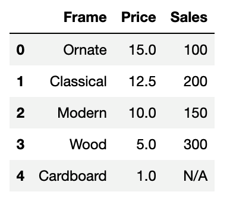

## Module 4.1: Introduction to Pandas

### Overview

In this lesson, students will be introduced to the basic operations and functions of the Pandas library, such as creating Series and DataFrames. They will have a chance to practice creating the Series and DataFrames, importing, organizing and exporting CSV files, and also learn about the loc and iloc functions, which are used to access and manipulate data within a DataFrame.

### Class Objectives

By the end of today's class, the students will be able to:

* Describe the makeup of a DataFrame.
* Import a CSV file using Pandas.
* Utilize the head and tail functions.
* Export a CSV file using Pandas.
* Create DataFrame from lists or dictionaries.
* Rename columns.

---

### Instructor Notes

Welcome students to this lesson on introducing Pandas. Today, we will dive into one of the most powerful Python libraries for data analysis: Pandas. By the end of this lesson, students will gain a comprehensive understanding of the basics of using Pandas, including creating, importing, and exporting data using DataFrames.

---

### Class Slides

The slides for this lesson can be viewed on Google Drive here: [Module 4.1 Slides](https://docs.google.com/presentation/d/1N_RRNNRIuDKWMfci9wVSIhJCmPqFbgWw0vaypReLvWc/edit?usp=sharing).

To add the slides to the student-facing repository, download the slides as a PDF by navigating to File, selecting "Download as," and then choosing "PDF document." Then, add the PDF file to your class repository along with other necessary files. You can view instructions for this [here](https://docs.google.com/document/d/1XM90c4s9XjwZHjdUlwEMcv2iXcO_yRGx5p2iLZ3BGNI/edit).

**Note:** Editing access is not available for this document. If you wish to modify the slides, create a copy by navigating to File and selecting "Make a copy...".

---

### Time Tracker

| Start Time | Number | Activity                                           | Duration |
| ---------- | ------ | -------------------------------------------------- | -------- |
| 6:30 PM    | 1      | Instructor Do: Introduction to the Class           | 0:05     |
| 6:35 PM    | 2      | Instructor Do: Introduction to Pandas              | 0:10     |
| 6:45 PM    | 3      | Instructor Do: Creating Series and DataFrames      | 0:10     |
| 6:55 PM    | 4      | Students Do: DataFrame Shop                        | 0:10     |
| 7:05 PM    | 5      | Review: DataFrame Shop                             | 0:05     |
| 7:10 PM    | 6      | Instructor Do: Reading and Writing CSVs            | 0:10     |
| 7:20 PM    | 7      | Instructor Do: Column Manipulation                 | 0:10     |
| 7:30 PM    | 8      | Students Do: Import, Organize, Export              | 0:15     |
| 7:45 PM    | 9      | Review: Import, Organize, Export                   | 0:15     |
| 8:00 PM    | 10     | Break                                              | 0:15     |
| 8:15 PM    | 11     | Instructor Do: Loc and iloc                        | 0:15     |
| 8:30 PM    | 12     | Everyone Do: Good Movies                           | 0:20     |
| 8:50 PM    | 13     | Students Do: Comic Books                           | 0:25     |
| 9:15 PM    | 14     | Review: Comic Books                                | 0:15     |
| 9:30 PM    | 15     | End Class                                          | 0:05     |

---

### 1. Instructor Do: Introduction to the Class (5 min)

Open the slideshow and use the first few slides to facilitate your welcome to the class. Cover the following points:

* Welcome the students, and explain that in today’s lesson they will be introduced to Python functions, why they are important, how to write and use functions, and document their code for improved readability.

* Let students know that they will be using Pandas, a software library within Python, to create, organize, and display DataFrames, which are essentially like spreadsheets consisting of rows and columns for data.

### 2. Instructor Do: Introduction to Pandas (10 min)

Introduce students to the powerful, open-source analytics library called Pandas, which is built into and runs on a Python environment. Pandas is a Python library designed specifically for data analytics and time series analysis, which are useful features for quantitative analytics. In essence, the Pandas software library can. be used for data manipulation, data analysis, and data visualization.

The goal of this section is to help students understand the relationship between Pandas and Python. In this part of the lesson, you will cover some specific features of Pandas and how Pandas can alleviate some of the challenges presented by Excel.

Use the slides and begin this part of the lesson by discussing the utility and history of spreadsheets.

Since spreadsheets appeared they transformed data analysis forever. However, as the volume and complexity of data have increased significantly, spreadsheets are now limited when it comes to data analysis.

Ask the class what pain points they have experienced while using spreadsheets to handle data. Possible answers include:

* Microsoft Office is expensive, or Google Spreadsheets is not as advanced as Excel.

* Cell formulas can be difficult to edit, especially when working with multiple workbooks.

* Formulas can be difficult to audit when they span multiple sheets, and no two analysts will build them in a consistent way

* Spreadsheets can only hold so much data; the more data that is stored, the slower the workbook runs.

* Excel files often stop responding and are vulnerable to corruption.

* Automation and custom function creation is not inherent. Macros and VBA need to be learned.

* Interacting with data or software outside the spreadsheet isn’t practical.

* Data is static in a spreadsheet, so it is difficult to use real time data.

Ask students if they have experienced any disasters or major challenges while working in Excel. Possible answers include:

* A large Excel workbook used so much of the laptop’s memory that it crashed or froze.

* Regional sales data for a sales competition was copied and pasted next to the wrong sales representatives. This resulted in the wrong person being identified as the winner.

* In a monthly budget spreadsheet, the Excel formula to calculate the remaining balance in a checking account did not include the entire cell range necessary for the calculation. This resulted in the account having a negative balance.

Explain to students that machine learning and AI models are trained using large amounts of datasets. Data in tabular format is easier to work with and therefore quite common. Pandas is by far the most popular library in Python for working with such data.

Although Python alone is stuck using lists, tuples, and dictionaries, Pandas lets Python programmers work with Series and DataFrames. A **DataFrame** is a table with rows and columns, similar to spreadsheets. Each column in a DataFrame is a **Series**.

## Application of Pandas

Explain to students that data manipulation, analysis, and visualization with Pandas extends to various fields, such as stock prediction, analytics, and data science, to name a few.

While no one can accurately predict how the stock market will perform, Pandas and other similar libraries may be able to assist in the simulation of potential performances based on historical data. Stock traders may even use data gathered through Pandas to time the buying or selling of stocks.

Data scientists and other professionals can use Pandas for advanced data manipulation, analysis, and visualization in web analytics, or analytics of software platforms and applications. Pandas significantly increases the efficiency of data manipulation.

### 3. Instructor Do: Creating Series and DataFrames (10 min)

**Corresponding Activity:** [01-Ins_Pandas_Intro](Activities/01-Ins_Pandas_Intro/)

Send the students to the [Pandas Documentation website](https://pandas.pydata.org/docs/) for more information on getting started, a user guide which includes in depth information on key Pandas concepts, an API reference guide, and a developer's guide.

Continue using the slideshow as you begin to discuss the next activity.

Open the solution within Jupyter notebook, and demonstrate to the class what Pandas Series and DataFrames are and how to create them. Cover the following key points:

* First, the Pandas library is imported using `import pandas as pd`. This method of import allows Pandas functions and methods to be called using the variable `pd`. Using `import pandas as pd` is convenient as `pd` as an alias for Pandas has become the standard within the Python community. `pd` instead of `pandas` is concise and also improves the readability of code.

* A Series is an ordered collection of values, like a single row or column of a spreadsheet.

* To create a Series, simply use the `pd.Series()` function and place a list within the parentheses as follows:

  ```python
  # We can create a Pandas Series from a raw list
  data_series = pd.Series(["UCLA", "UC Berkeley", "UC Irvine",
                          "University of Central Florida", "Rutgers University"])
  data_series
  ```

    * The index for the values in the Series will be the numeric index of the initial list, as captured in the following image:

    

* There’s more than one way to create DataFrames from scratch. One way is to use the `pd.DataFrame()` function and provide it with a list of dictionaries. Each dictionary will represent a new row where the keys become column headers and the values are placed inside the table as the following code shows:

  ```python
  # Convert a list of dictionaries into a DataFrame
  states_dicts = [{"STATE": "New Jersey", "ABBREVIATION": "NJ"},
                  {"STATE": "New York", "ABBREVIATION": "NY"}]

  states_df = pd.DataFrame(states_dicts)
  states_df
  ```

  

* Another way to use the `pd.DataFrame()` function is to provide it with a dictionary of lists. The keys of the dictionary will be the column headers, and the listed values will be placed into their respective rows as the following code shows:

  ```python
  pharaoh_df = pd.DataFrame(
      {"Dynasty": ["Early Dynastic Period", "Old Kingdom"],
      "Pharaoh": ["Narmer", "Khufu"],
      "Capital": ["Thinis", "Memphis"]
      }
  )
  pharaoh_df
  ```

  

### 4. Student Do: DataFrame Shop (10 min)

**Corresponding Activity:** [02-Stu_DataFrame_Shop](Activities/02-Stu_DataFrame_Shop/)

Explain to students that they need to create a DataFrame for a frame shop. The DataFrame should contain three columns, "Frame", "Price", and "Sales", and have five rows of data stored within it.

Using an alternative method, they should create a DataFrame for an art gallery. The DataFrame should contain three columns, "Painting", "Price", and "Popularity", and have four rows of data stored within it.

Continue the slideshow to introduce this activity to the class.

### 5. Review: DataFrame Shop (5 min)

**Corresponding Activity:** [02-Stu_DataFrame_Shop](Activities/02-Stu_DataFrame_Shop/)

Open the solution, share the file with the students, and go over with the class, answering whatever questions students may have.

Cover the following key points during the discussion:

* It is important to save the created DataFrames to a variable. Otherwise, they will only be printed to the screen, and they will not be available for use later.

* Although the list-of-dictionaries method of DataFrame creation is viable, it takes longer to write the code because the keys have to be rewritten each time. However, it allows the programmer to better understand each row in their DataFrame as the following code shows:

```python
# The data is given in dictionaries
row1 = {"Painting": "Mona Lisa (Knockoff)", "Price": 25,
     "Popularity": "Very Popular"}
row2 = {"Painting": "Van Gogh (Knockoff)", "Price": 20, "Popularity": "Popular"}
row3 = {"Painting": "Starving Artist", "Price": 10, "Popularity": "Average"}
row4 = {"Painting": "Toddler Drawing", "Price": 1, "Popularity": "Not Popular"}

# Create a list containing the dictionaries
data = [row1, row2, row3, row4]

# Create a dataframe using the list of dictionaries
painting_df = pd.DataFrame(data)
painting_df
```

Show students that the output of the DataFrame should look like this:


* The dictionary-of-lists method is more time efficient because the keys only need to be written once as the following code shows. The DataFrame can be harder to read through, because if even one of the lists contains fewer values than the others, then an error will be returned.

```python
# The data is given in lists
frame_column = ["Ornate", "Classical", "Modern", "Wood", "Cardboard"]
price_column = [15.00, 12.50, 10.00, 5.00, 1.00]
sales_column = [100, 200, 150, 300, "N/A"]

# Create a dictionary containing the lists
data = {
    "Frame": frame_column,
    "Price": price_column,
    "Sales": sales_column
}

# Create a dataframe using the dictionary of lists
frame_df = pd.DataFrame(data)
frame_df
```

Show students that the output of the DataFrame should look like this:



Ask the class which method of creating a DataFrame they preferred, and ask them to provide a reason for their choice.

### 6. Instructor Do: Reading and Writing CSVs (10 min)

**Corresponding Activity:** [03-Ins_Reading_Writing_CSV](Activities/03-Ins_Reading_Writing_CSV)

Continue using the slideshow to accompany this demonstration.

#### CSV Files

Explain to students what CSV files are. Comma separated value, or CSV, files consist of data or values that are separated by commas. CSV files are widely recognized among spreadsheet applications like Excel or Google Sheets that are able to read CSV files, and convert them into a spreadsheet format with rows and columns. Each comma represents a new cell within the spreadsheet. Most spreadsheet applications can not only read .csv files, but also write them, or save spreadsheet data into .csv files.

CSV files are used across various industries and applications. Some of the use cases include:

* Importing and exporting data: Data can be transferred through CSV files across different software applications such as MySQL, Excel, or Pandas. CSV files are also useful during data migration between different applications or platforms.

* Data analysts: Data analyst professionals can easily manipulate and make use of data stored in CSV files.

* Data backups: Backups of data are easily created through CSV files.

#### Different Encoding Types For CSV files

Explain to students the different types of encoding types when it comes to CSV files. When interpreting data within CSV files, it's important to know how the data was encoded. Data can be encoded through a variety of encoding types, which have different advantages and disadvantages respectively. Some examples of encoding types include:

* UTF-8 (Unicode Transformation Format 8-bit): This is the most common type of encoding, which can represent most characters and symbols.

* UTF-16 (Unicode Transformation Format 16-bit): This encoding type can represent a larger range of characters than UTF-8 but also requires more storage space.

* ASCII (American Standard Code for Information Interchange): ASCII encoding represents English characters and some symbols, but does not support other languages.

* ISO-8859-1: This encoding standard is used for Western European languages, and can also represent characters from the Latin alphabet.

#### Reading and Writing CSV Files

Thus far, you have created DataFrames using the `pd.DataFrame()` method. Now, you will learn to create DataFrames from external CSV files. Open the solution file with Jupyter notebook, and go through the code with the class.

* First, we import the Pandas library as `pd`:

  ```python
  # Dependencies
  import pandas as pd
  ```

* Next, we create a variable that holds the file path, then read the data file using the Pandas `pd.read_csv()` method as follows:

    ```python
  # Store filepath in a variable
  file_one = "Resources/DataOne.csv"

  # Read our data file with the Pandas library
  # Not every CSV requires encoding, but be aware this can come up
  file_one_df = pd.read_csv(file_one, encoding="ISO-8859-1")
  file_one_df.head()
  ```

* In most cases, it is not important to use or define the encoding of the base CSV file; however, if the encoding is different than `'utf-8'`, then it may become necessary so that the CSV is translated correctly.

* The following image captures the code in Jupyter notebook for how to read a CSV file with ISO-8859-1 encoding into Pandas and then display the head of its contents.

  

* It is just as easy to write to a CSV file as it is to read from one. Simply use the `df.to_csv()` method, and pass the path to the desired output file as the following code shows:

  ```python
  # Export file as a CSV, without the Pandas index, but with the header
  file_one_df.to_csv("Output/fileOne.csv", index=False, header=True)
  ```

    * By using the `index` and `header` parameters, programmers can also manipulate whether they would like the index or header for the table to be passed as well.

* Pandas can only write to a new CSV file in existing directories. If the path to the output file contains a directory that doesn’t exist, Pandas will return a `FileNotFoundError`.

Data Source: Data generated by Mockaroo, LLC. (2021) Realistic Data Generator. [https://www.mockaroo.com/](https://mockaroo.com/). Data for this dataset was generated by edX Boot Camps LLC, and is intended for educational purposes only.

### 7. Instructor Do: Column Manipulation (10 min)

**Corresponding Activity:** [04-Ins_Column_Manipulation](Activities/04-Ins_Column_Manipulation)

Continue using the slideshow to accompany this demonstration.

#### The Importance of Reordering Columns

Explain to the class the importance of reordering columns. Columns within a DataFrame are not always placed in the desired position by default. It may be necessary to reorder the columns so that they appear in a different order. The following situations may require reordering of columns:

* Personal preference: Individuals may have different preferences and can reorder the columns to suit their preferences. For example, some data analysts prefer grouping date columns together, while others may prefer the order date to be grouped with the client name.

* Data analysis: Datasets can be bulky at times, given the amount of data that can be collected. It may make sense to reorder columns to group certain types of data together, which may facilitate smoother data analysis. For example, qualitative data on individuals can be grouped together, and their quantitative data can be grouped separately.

* Data visualization: Since datasets can be bulky, it may make sense to reorder columns so that the data flows better, and is more presentable and accessible.

#### Named Columns and Data Integrity

Sometimes, columns may not have a descriptive or concise name. It’s critical that column names are concise, accurate, and consistent. This enhances the clarity and readability of data, and users of the DataFrame will have no issues understanding the data structure. Accurately named columns also allow the data analysis and manipulation to function better by reducing ambiguity and chance of errors. In large datasets, things may become confusing. Appropriately labeled columns reduce the chances for misinterpretation, and ensure a high level of interoperability between datasets.

#### Column Manipulation

* Thankfully, it’s very easy to modify the name or placement of a column with the `rename()` function and the use of double parentheses.

* Open the solution file within Jupyter notebook, and go through the code with the class.

    * To collect a list of all the columns contained within a DataFrame, simply use the `df.columns` call, and an object containing the column headers will be printed to the screen.

    * To reorder the columns, create a reference to the DataFrame followed by two parentheses with the column headers placed in the desired order as follows:

    ```python
    # Reorganize the columns using double brackets
    organized_df = people_df[["last_name","company_name","city","email"]]
    organized_df.head()
    ```

    * It is also possible to remove columns by simply not creating a reference to them. This will, in essence, drop them from the newly made DataFrame.

    * To rename the columns within a DataFrame, use the `df.rename()` method and place `columns={}` within the parentheses. Inside the dictionary, the keys should be references to the current columns, and the values should be the desired column names as the following code shows:

    ```python
    # Use .rename(columns={}) to rename columns
    renamed_df = organized_df.rename(columns={"last_name":"Last Name", "company_name":"Company", "city": "City", "email": "Email"})
    renamed_df.head()
    ```

    * The following image captures how to rename the columns of a DataFrame.


Data Source: Data generated by Mockaroo, LLC. (2021) Realistic Data Generator. [https://www.mockaroo.com/](https://mockaroo.com/). Data for this dataset was generated by edX Boot Camps LLC, and is intended for educational purposes only.

### 8. Student Do: Columns (15 min)

**Corresponding Activity:** [05-Stu_Columns](Activities/05-Stu_Columns)

Continue through the slideshow, using the next slides as an accompaniment to this activity.

This activity will give students the opportunity to practice how to import data, reorder the columns, and export the data to a new CSV file. Remind students about the purpose of organizing and modifying DataFrame columns and how it can assist in improving readability and analysis.

In this activity, you will take a pre-made DataFrame of donors to a non-profit organization and reorganize it so that it improves readability and analysis.

Data Source: Data generated by Mockaroo, LLC. (2021) Realistic Data Generator. [https://www.mockaroo.com/](https://mockaroo.com/). Data for this dataset was generated by edX Boot Camps LLC, and is intended for educational purposes only.

### 9. Review: Import Organize Export (10 min)

**Corresponding Activity:** [05-Stu_Columns](Activities/05-Stu_Columns)

Share and live code the solution with the class, answering whatever questions students may have.

* First, we take the currently named columns and convert them into the more readable versions using the following code:

  ```python
  # Rename columns for readability
  donors_df_renamed = donors_df.rename(columns={"donorName": "Donor",
                                                "employerName": "Employer",
                                                "zipcode": "Zip Code",
                                                "usd": "Donation Amount"
                                                })
  donors_df_renamed.head()
  ```

* Then, using double parentheses, the new columns are reorganized and placed into another new variable, which now holds the fully formatted DataFrame, as the following code demonstrates:

  ```python
  # Organize the columns so that only the donor name,
  # amount, employer, and city are displayed.
  # The name and donation amount should be first

  donors_df_organized = donors_df_renamed[['Donor',
                                         'Donation Amount',
                                         'Employer',
                                         'City'
                                         ]]

  donors_df_organized.head()
  ```

* The following image captures how to reorganize the DataFrame columns:

  

---

### 10. Break (15 minutes)

---

### 11. Instructor Do: Indexing (15 min)

**Corresponding Activity:** [06-Ins_Indexing](Activities/06-Ins_Indexing)

Continue using the slideshow to accompany this demonstration.

Explain that one of the most powerful aspects of Pandas is that programmers can easily collect specific rows and columns of data from a DataFrame using the `loc` and `iloc` methods. The `loc` and `iloc` methods allow extraction, modification, and manipulation of data based on labels (`loc`) or integer-based indices (`iloc`).

* The `loc` method allows us to select data using label-based indexes. In other words, it takes in strings as the keys and returns data based on those keys.

* Using `loc` to search through rows is most useful when the index of a dataset is a collection of strings. However, it is almost always useful when selecting data from columns because column headers are exclusively strings. `loc` can also be used with conditional statements to select rows with particular values or attributes.

`loc` and `iloc` functions are used for data extraction, label-based indexing, position-based indexing, slicing and subsetting data, conditional data filtering, and data modification and assignment. These functions enhance the flexibility of data manipulation and analysis, and allow complex operations to be performed on tabular data structures.

Open the solution file within the Jupyter notebook, send the file to students, and go through the code line by line with the class.

* To read the CSV as a DataFrame, use the following code:

```python
# Import libraries and dependencies
import pandas as pd

# Set the file path
file_path = '../Resources/people.csv'

# Read in the CSV as a DataFrame
people_csv = pd.read_csv(file_path)
people_csv.head()
```

* The `iloc` method also allows us to select data using integer-based indexing for selection by position. In other words, it selects data like one would select data from within a list: it uses a numeric index.

* To use `iloc`, pass the row (or rows) and optionally the column (or columns) inside a set of square brackets, separated by a comma.

* Demonstrate the use of `iloc` to select various rows and columns:

```python
# Select the first row of the DataFrame
people_csv.iloc[0]

# Select the second row of the DataFrame
people_csv.iloc[1]

# Select the first 10 rows of the DataFrame
people_csv.iloc[0:10]

# Select the last row of the DataFrame
people_csv.iloc[-1]

# Select the first column of the DataFrame
people_csv.iloc[:,0].head()

# Select the second column of the DataFrame, with all rows
people_csv.iloc[:,1].head()

# Select the last column of the DataFrame, with all rows
people_csv.iloc[:,-1].head()

# Select the first two columns of the DataFrame, with all rows
people_csv.iloc[:, 0:2].head()

# Select the 1st, 5th, 8th, 22nd rows of the 1st 4th and 6th columns.
people_csv.iloc[[0,4,7,21], [0,3,5]]

# Select the first 5 rows of the 3rd, 4th, and 5th columns of the DataFrame
people_csv.iloc[0:5, 2:5]
```

* Demonstrate the use of `iloc` to assign new values in the DataFrame.

```python
# Modify the 'first_name' column value of the first row
people_csv.iloc[0, people_csv.columns.get_loc('first_name')] = 'Arya'
people_csv.head()
```

* `loc` can be used to select rows and columns using the index of the row and column name rather than the integer location of the row and column. This is especially useful if the index column is set to a string.

* Show students that `loc` is easiest to use on the index of the DataFrame, and that a new index can be specified using the set_index function. Clarify that an index in Pandas can have repeated values, but these values will make it impossible to select a single row with that value without doing some more work. Choose your index wisely!

```python
# Indexing
people_csv.set_index(people_csv['first_name'])
people_csv.head()

# Set the index as the 'first_name' column
people_csv.set_index(people_csv['first_name'], inplace=True)
people_csv.head()

# Sort by the index
people_csv = people_csv.sort_index()

# Select the row with the index 'Evan'
people_csv.loc['Evan']

# Slice the data to output a range of rows based on the index
people_csv.loc['Aleshia':'Svetlana'].head()

# Filter rows based on a column value conditional
people_csv.loc[people_csv['age'] == 39].head()
```

* As with `iloc`, demonstrate how `loc` can also be used to set values in the DataFrame.

```python
# Modify the 'first_name' value of the row with the index 'Yun'
people_csv.loc['Yun', 'first_name'] = 'Yuna'
people_csv.head()
```

Data Source: Data generated by Mockaroo, LLC. (2021) Realistic Data Generator. [https://www.mockaroo.com/](https://mockaroo.com/). Data for this dataset was generated by edX Boot Camps LLC, and is intended for educational purposes only.

### 12. Everyone Do: Good Movies (20 min)

**Corresponding Activity:** [07-Evr_GoodMovies_Loc](Activities/07-Evr_GoodMovies_Loc)

Continue through the slideshow, using the next slides to accompany this activity.

Open and share the starter file, then code the solution with the class, answering any questions that students may have. Make sure to focus students on thinking through more complex questions like the following before diving in:

* What does it mean to find an “undiscovered gem” of a movie?

* What data could be used to find such movies?

* Is a rating of 7 a good measure to start with?

* Is rating enough or is more data needed?

* How many votes would a movie need to be popular?

Cover the following key points during your review:

* We’ll define good movies as those that scored over 7.

* We’ll define less popular movies as movies that have fewer than 20K votes.

* Since the user is only interested in data that pertains to IMDb, all rows that contain non-IMDb review information are filtered out manually by simply dropping those rows.

* To collect only the films with a score greater than or equal to 7, a conditional `loc` filter is used that looks into the "IMDB" column and only collects those rows that pass through the logic test with a True value.

* To collect those films that have fewer than 20K votes, another conditional `loc` filter is used that searches through the "IMDB_user_vote_count" column and only collects those rows that pass through the logic test with a True value.

* The following image captures the code and outputs for this activity:

  

Data Source: FiveThirtyEight. 2015. Fandango score comparison CSV. Available: [https://github.com/fivethirtyeight/data/blob/master/fandango/fandango_score_comparison.csv](https://github.com/fivethirtyeight/data/blob/master/fandango/fandango_score_comparison.csv) ([CC-BY 4.0](https://creativecommons.org/licenses/by/4.0/legalcode)).

### 13. Students Do: Comic Books (25 min)

**Corresponding Activity:** [08-Stu_Comic_Books_CSV](Activities/08-Stu_Comic_Books_CSV)

Continue through the slideshow, using the next slides to accompany this activity.

This activity serves as a culmination of the prior parts of this module, and will give students a chance to practice all of the skills they have learned.

The students will now take a large CSV file containing comic books, read it into the Jupyter notebook using Pandas, clean up the columns, and answer a few short questions using analysis.

Return to the slideshow to introduce the activity and read the instructions to the students.

### 14. Review: Comic Books (15 min)

**Corresponding Activity:** [08-Stu_Comic_Books_CSV](Activities/08-Stu_Comic_Books_CSV)

Open the solution, share and review the file with the class, answering whatever questions students may have.

Cover the following key points during the discussion:

Continue using the slideshow to facilitate a review of the activity.

Open the solution file, share the file and go through the code with the class, answering any questions that students may have.

Cover the following key points when discussing this activity:

* The initial CSV file is encoded using UTF-8, so it can be read in without the encoding parameter. `.tail()` can be used to view some of the special characters at the end of this DataFrame, as captured in the following image:

  

* Next, we remove unnecessary columns, as the following code shows:

  ```python
    # Remove unnecessary columns from the DataFrame and save the new DataFrame
    # Only keep: "ISBN", "Title", "Other titles", "Name", "All names",
    # "Country of publication", "Place of publication", "Publisher", "Date of publication"
    reduced_df = books_df[["ISBN", "Title", "Other titles", "Name", "All names",
                          "Country of publication", "Place of publication",
                          "Publisher", "Date of publication"]]
    reduced_df.head()
    ```

* Then, we rename some of the columns as follows:

  ```python
  # Rename the columns.
  renamed_df = reduced_df.rename(columns={"Other titles": "Other Titles",
                                          "Name": "Author",
                                          "All names": "All Names",
                                          "Country of publication": "Country of Publication",
                                          "Place of publication": "Place of Publication",
                                          "Date of publication": "Publication Year", })
  renamed_df.head()
  ```

    * The result is a cleaned DataFrame that is ready for analysis.

    

Continue using the solution file to facilitate a review of the activity.

* To find out how many comics were published in the 1960s, use the following code:

```python
# Calculate the number of comics published in the 1960s
comics_1960s_df = comics_df.loc[(comics_df['Publication Year'] >= 1960) & (comics_df['Publication Year'] <1970)]
len(comics_1960s_df)
```

* To find out if there are more Batman or Superman comics, the solution file provides two options. Let students know that either solution will work, but that using a function makes it easy for us to answer similar questions later:

```python
# Are there more Batman comics or Superman comics?
# To start, how many Batman comics are listed?
batman_comic_df = comics_df.loc[comics_df['Title'].str.contains('Batman', case=False)]
len(batman_comic_df)

# Alternate solution with function
def search_titles_for_string(search_term):
    search_df = comics_df[comics_df['Title'].str.contains(search_term, case=False)]
    return len(search_df)

search_titles_for_string("Batman")
```

* There are 423 Batman comics.

```python
# How many Superman comics are listed?
superman_comic_df = comics_df.loc[comics_df['Title'].str.contains('Superman', case=False)]
len(superman_comic_df)

# Alternate solution using function
search_titles_for_string("Superman")
```

* There are 260 Superman comics.

* There are more Batman comics than Superman comics in the dataset.

### 15. End Class (5 min)

Congratulate students on completing this lesson. Ask how they feel about Pandas up until this point, and remind them that practicing the functions will make them more familiar.

Remind students what they learned In this class: the basics of Pandas, creating DataFrames, and manipulating columns within a DataFrame, how to import and export CSV files, and selecting data from DataFrames with the use of the `loc` and `iloc` functions.

Let students know that, in the next lesson, they will start exploring data with Pandas, sorting values in a DataFrame, viewing summary statistics of a DataFrame, and filtering data within a DataFrame.

**Reflection and Feedback:** At the end of each day or module, encourage students to reflect on what they've learned and provide an avenue for them to give feedback. This could be a quick survey, a discussion forum, or an open-ended questionnaire.

---

© 2023 edX Boot Camps LLC. Confidential and Proprietary. All Rights Reserved.
